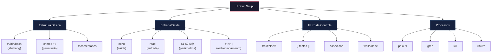

# 🐧 COM104 — Aula 11: Gabarito Comentado — Shell Script

**Disciplina:** Sistemas Operacionais  
**Prof:** João Pedro Gress  
**Tema:** Administração básica de sistemas Linux e comandos essenciais  

---

> [!NOTE]
> Este gabarito é **didático**. Cada script é construído passo a passo, com explicações detalhadas de **por que** cada linha existe, não apenas **o que** ela faz. Leia os comentários e as seções "Entendendo o código" antes de copiar.

---

## Exercício 1 — `saudacao.sh`

### O que vamos aprender aqui?
- Como criar a estrutura básica de um script
- Como usar `echo` para exibir texto
- Como usar `read -p` para capturar entrada do usuário
- Como armazenar a saída de um comando em uma variável

### Construindo passo a passo

**Passo 1 — O shebang:**

Todo script Bash começa com uma linha especial chamada **shebang**. Ela diz ao sistema operacional qual interpretador deve ser usado para executar o arquivo:

```bash
#!/bin/bash
```

Sem essa linha, o sistema pode tentar interpretar o script com outro shell (como `sh` ou `dash`), e comandos específicos do Bash podem não funcionar.

**Passo 2 — Exibir uma mensagem fixa:**

O comando `echo` imprime texto na tela. É o equivalente ao `print()` do Python ou `System.out.println()` do Java:

```bash
echo "Bem-vindo ao sistema Linux!"
```

**Passo 3 — Capturar o nome do usuário:**

O comando `read` pausa o script e espera o usuário digitar algo. O parâmetro `-p` permite colocar uma mensagem na mesma linha:

```bash
read -p "Digite seu nome: " nome
```

Aqui, `nome` é o nome da variável que vai guardar o que o usuário digitar. Você escolhe o nome — poderia ser `usuario`, `input`, qualquer coisa.

**Passo 4 — Pegar a data atual:**

O comando `date` exibe a data/hora do sistema. Com `+%d/%m/%Y` formatamos para dia/mês/ano. Usamos `$(comando)` para capturar a saída:

```bash
DATA=$(date +%d/%m/%Y)
```

> [!TIP]
> `$(comando)` é a forma moderna de capturar a saída de um comando. A forma antiga usa crases `` `comando` `` — ambas funcionam, mas `$()` é mais legível e permite aninhamento.

**Passo 5 — Exibir a saudação final:**

Dentro de aspas duplas, variáveis são expandidas (substituídas pelo seu valor):

```bash
echo "Olá, $nome! Hoje é $DATA."
```

### Script completo

```bash
#!/bin/bash
# ==============================================
# saudacao.sh — Saudação personalizada
# Conceitos: echo, read, variáveis, date
# ==============================================

# Exibe mensagem de boas-vindas
echo "Bem-vindo ao sistema Linux!"

# Captura o nome do usuário (-p exibe o prompt na mesma linha)
read -p "Digite seu nome: " nome

# Armazena a data atual formatada em uma variável
# +%d = dia, +%m = mês, +%Y = ano com 4 dígitos
DATA=$(date +%d/%m/%Y)

# Exibe a saudação com o nome e a data
# As aspas duplas permitem que $nome e $DATA sejam substituídos
echo "Olá, $nome! Hoje é $DATA."
```

### Como executar

```bash
chmod +x saudacao.sh    # Dá permissão de execução (só precisa fazer uma vez)
./saudacao.sh           # Executa o script
```

### Entendendo o fluxo


---

## Exercício 2 — `soma.sh`

### O que vamos aprender aqui?
- Como receber dados via **parâmetros de linha de comando** (`$1`, `$2`)
- Como fazer **aritmética** no Bash com `$(( ))`

### Construindo passo a passo

**Passo 1 — Entender parâmetros posicionais:**

Quando você executa `./soma.sh 15 27`, o Bash automaticamente cria variáveis:
- `$0` → `./soma.sh` (nome do script)
- `$1` → `15` (primeiro argumento)
- `$2` → `27` (segundo argumento)

Você **não precisa declarar** essas variáveis — elas já existem.

**Passo 2 — Fazer a conta:**

O Bash trata tudo como texto por padrão. Para fazer contas, precisamos usar `$(( ))`:

```bash
RESULTADO=$(( $1 + $2 ))
```

Dentro de `$(( ))`, o Bash entra em "modo aritmético" e trata os valores como números.

### Script completo

```bash
#!/bin/bash
# ==============================================
# soma.sh — Calculadora de soma
# Conceitos: parâmetros posicionais, aritmética
# ==============================================

# $1 = primeiro número passado na linha de comando
# $2 = segundo número passado na linha de comando
# $(( )) = contexto aritmético do Bash

RESULTADO=$(( $1 + $2 ))

echo "A soma de $1 + $2 é: $RESULTADO"
```

### Como executar

```bash
chmod +x soma.sh
./soma.sh 15 27
# Saída: A soma de 15 + 27 é: 42
```

> [!WARNING]
> Se o usuário não passar os dois números, o script vai dar erro ou calcular errado. Uma melhoria seria validar com `$#` (número de argumentos), mas isso está fora do escopo deste exercício.

---

## Exercício 3 — `variaveis.sh`

### O que vamos aprender aqui?
- Como acessar **variáveis de ambiente** do sistema
- A diferença entre aspas simples e duplas

### Conceito-chave: Aspas

| Tipo | Sintaxe | Variáveis expandem? | Exemplo |
|------|---------|---------------------|---------|
| Duplas | `"texto"` | ✅ Sim | `echo "$HOME"` → `/home/maria` |
| Simples | `'texto'` | ❌ Não | `echo '$HOME'` → `$HOME` |
| Nenhuma | `texto` | ✅ Sim | Funciona, mas pode causar problemas com espaços |

A regra de ouro: **use sempre aspas duplas** quando quiser que variáveis sejam substituídas.

### Script completo

```bash
#!/bin/bash
# ==============================================
# variaveis.sh — Explorador de variáveis de ambiente
# Conceitos: variáveis de ambiente, echo, aspas duplas
# ==============================================

# Variáveis de ambiente são pré-definidas pelo sistema no login.
# Elas ficam em MAIÚSCULAS por convenção.
# O $ antes do nome é o que diz ao Bash: "me dê o VALOR desta variável".

echo "===== INFORMAÇÕES DO SISTEMA ====="
echo "Usuário......: $USER"
echo "Home.........: $HOME"
echo "Shell........: $SHELL"
echo "Diretório....: $PWD"
echo "Hostname.....: $(hostname)"
echo "=================================="

# Nota: $HOSTNAME existe em alguns sistemas, mas $(hostname) é mais portável.
# $(hostname) executa o comando 'hostname' e insere a saída no lugar.
```

### Como executar

```bash
chmod +x variaveis.sh
./variaveis.sh
```

### Por que essas variáveis já existem?

Quando você faz login no Linux, o sistema carrega variáveis de ambiente a partir de arquivos como `/etc/profile` e `~/.bashrc`. Elas configuram seu ambiente de trabalho. Você pode ver todas com o comando `env`.

---

## Exercício 4 — `verificar.sh`

### O que vamos aprender aqui?
- Como usar **testes condicionais** (`[[ ]]`)
- Os operadores de teste de arquivo (`-f`, `-d`, `-r`, `-w`, `-x`)
- O padrão `&& ... || ...` (equivalente a if/else em uma linha)

### Conceito-chave: Testes

No Bash, `[[ condição ]]` avalia uma expressão e retorna:
- **0** se verdadeiro (sucesso)
- **1** se falso (falha)

Isso é o **inverso** da maioria das linguagens (onde 0 = falso), porque no Linux, 0 = tudo OK.

O padrão `comando && faz_se_sucesso || faz_se_falha` funciona assim:
- Se o comando retorna 0 → executa o que está depois de `&&`
- Se retorna 1 → executa o que está depois de `||`

### Script completo

```bash
#!/bin/bash
# ==============================================
# verificar.sh — Verificador de arquivo/diretório
# Conceitos: testes condicionais, operadores de arquivo
# ==============================================

# Verifica se o usuário passou um argumento
# $# contém a quantidade de argumentos recebidos
if [[ $# -eq 0 ]]; then
    echo "Uso: ./verificar.sh <caminho_do_arquivo>"
    echo "Exemplo: ./verificar.sh /etc/passwd"
    exit 1   # Sai do script com código de erro
fi

# $1 contém o caminho que o usuário passou
ARQUIVO="$1"

echo "Verificando: $ARQUIVO"
echo ""

# -f testa se é um arquivo regular (não é diretório, nem link, nem dispositivo)
[[ -f "$ARQUIVO" ]] && echo "[✓] É um arquivo regular" || echo "[✗] Não é um arquivo regular"

# -d testa se é um diretório
[[ -d "$ARQUIVO" ]] && echo "[✓] É um diretório" || echo "[✗] Não é um diretório"

# -r testa se o usuário atual tem permissão de leitura
[[ -r "$ARQUIVO" ]] && echo "[✓] Tem permissão de leitura" || echo "[✗] Não tem permissão de leitura"

# -w testa se o usuário atual tem permissão de escrita
[[ -w "$ARQUIVO" ]] && echo "[✓] Tem permissão de escrita" || echo "[✗] Não tem permissão de escrita"

# -x testa se o usuário atual tem permissão de execução
[[ -x "$ARQUIVO" ]] && echo "[✓] Tem permissão de execução" || echo "[✗] Não tem permissão de execução"
```

### Como executar

```bash
chmod +x verificar.sh
./verificar.sh /etc/passwd
./verificar.sh /home
./verificar.sh /arquivo_que_nao_existe
```

### Por que as aspas em `"$ARQUIVO"`?

Se o caminho contiver espaços (ex: `/home/user/meu arquivo.txt`), sem aspas o Bash quebraria em duas palavras e o teste falharia. **Sempre coloque variáveis entre aspas duplas** em testes.

---

## Exercício 5 — `parametros.sh`

### O que vamos aprender aqui?
- As **variáveis especiais** do Bash e para que servem

### Referência rápida

| Variável | Significado | Exemplo |
|----------|-------------|---------|
| `$0` | Nome do script | `./parametros.sh` |
| `$1`..`$9` | Argumentos posicionais | Valores passados |
| `$#` | Quantidade de argumentos | `4` |
| `$@` | Todos os argumentos (como lista) | `linux shell bash script` |
| `$$` | PID do processo atual | `12345` |
| `$?` | Status de saída do último comando | `0` (sucesso) |
| `$!` | PID do último processo em background | — |

### Script completo

```bash
#!/bin/bash
# ==============================================
# parametros.sh — Demonstrando variáveis especiais
# Conceitos: $0, $#, $@, $$, $?
# ==============================================

# $0 — O nome do próprio script (como foi chamado)
echo "Nome do script...: $0"

# $# — Quantos argumentos foram passados (não conta o $0)
echo "Nº de parâmetros.: $#"

# $@ — Lista todos os argumentos, preservando espaços
# Diferença sutil: "$@" preserva cada argumento como item separado
# enquanto "$*" junta tudo em uma string só
echo "Parâmetros.......: $@"

# $$ — O PID (Process ID) do shell que está executando este script
# Cada processo no Linux tem um número único de identificação
echo "PID do shell.....: $$"

# $? — O código de retorno do último comando executado
# 0 = sucesso, qualquer outro valor = erro
# Como o echo acima funcionou, $? será 0
echo "Status anterior..: $?"
```

### Como executar

```bash
chmod +x parametros.sh
./parametros.sh linux shell bash script
```

---

## Exercício 6 — `continuar.sh`

### O que vamos aprender aqui?
- Como combinar `read` com **testes condicionais** para criar fluxo de decisão
- O uso de `if/elif/else/fi` (estrutura condicional completa)

### Conceito-chave: if no Bash

A estrutura condicional do Bash tem esta sintaxe:

```bash
if [[ condição ]]; then
    # bloco executado se condição for verdadeira
elif [[ outra_condição ]]; then
    # bloco executado se a segunda condição for verdadeira
else
    # bloco executado se nenhuma condição for verdadeira
fi    # ← obrigatório: fecha o if
```

> [!IMPORTANT]
> O `fi` é **obrigatório** — é o `if` ao contrário, e marca o fim do bloco condicional. Esquecer dele causa erro de sintaxe.

### Script completo

```bash
#!/bin/bash
# ==============================================
# continuar.sh — Confirmação interativa
# Conceitos: read, if/elif/else, testes de string, ps, pipe
# ==============================================

# Pergunta ao usuário e armazena a resposta
read -p "Deseja listar os processos do sistema? [s/n]: " resposta

# Estrutura condicional para decidir o que fazer
# == compara strings (texto), não números
if [[ "$resposta" == "s" ]]; then
    echo ""
    echo "--- Processos ativos (primeiros 20) ---"
    # ps aux = lista TODOS os processos de TODOS os usuários
    # | = pipe: envia a saída de ps para o comando head
    # head -20 = mostra apenas as 20 primeiras linhas
    ps aux | head -20
    echo "--- Fim da listagem ---"

elif [[ "$resposta" == "n" ]]; then
    echo "Operação cancelada."
    exit 0    # Sai com código 0 (sucesso, pois o usuário escolheu sair)

else
    echo "Opção inválida. Use 's' para sim ou 'n' para não."
    exit 1    # Sai com código 1 (erro: entrada não reconhecida)
fi
```

### Como executar

```bash
chmod +x continuar.sh
./continuar.sh
```

### O que é o pipe `|`?

O pipe conecta a **saída** de um comando à **entrada** de outro. É como um cano que transfere dados:

```
ps aux   →   |   →   head -20
(gera lista)       (filtra primeiras 20 linhas)
```

Sem o pipe, `ps aux` mostraria centenas de linhas. O `head -20` corta para mostrar só o começo.

---

## 🔥 Desafio — `monitor.sh`

### O que vamos aprender aqui?
- **Loop infinito** com `while true`
- **Estrutura `case`** (equivalente ao switch de outras linguagens)
- **Funções** para organizar o código
- **Redirecionamento** de saída para arquivo (`>`, `>>`)
- Combinar **todos os conceitos** anteriores

### Conceitos novos usados

**1. `while true; do ... done` — Loop infinito:**

```bash
while true; do
    # código que repete para sempre
    # até encontrar um 'break' ou 'exit'
done
```

**2. `case $variavel in ... esac` — Múltiplas condições:**

É mais limpo que vários `if/elif` quando você tem muitas opções:

```bash
case $opcao in
    1) echo "Escolheu 1" ;;   # ;; = fim deste caso
    2) echo "Escolheu 2" ;;
    *) echo "Opção inválida" ;;  # * = qualquer outra coisa (default)
esac   # ← 'case' ao contrário, fecha o bloco
```

**3. Redirecionamento `>` e `>>`:**

| Operador | Ação |
|----------|------|
| `>` | Cria o arquivo (ou **sobrescreve** se já existir) |
| `>>` | **Acrescenta** ao final do arquivo (não apaga o conteúdo anterior) |

### Script completo

```bash
#!/bin/bash
# ==============================================================
# monitor.sh — Monitor de Processos Interativo
# Conceitos: while, case, funções, ps, grep, kill, redirecionamento
# ==============================================================

# --- CORES (códigos ANSI para deixar o terminal colorido) ---
# \e[ inicia uma sequência de escape
# 1; = negrito, 32m = verde, 33m = amarelo, 31m = vermelho, 0m = reset
VERDE='\e[1;32m'
AMARELO='\e[1;33m'
VERMELHO='\e[1;31m'
CIANO='\e[1;36m'
RESET='\e[0m'

# --- FUNÇÃO: Exibir o menu ---
# Funções no Bash são definidas com nome() { } e chamadas pelo nome
exibir_menu() {
    echo ""
    echo -e "${CIANO}========================================${RESET}"
    echo -e "${CIANO}   MONITOR DE PROCESSOS — Linux v1.0${RESET}"
    echo -e "${CIANO}========================================${RESET}"
    echo -e "  ${VERDE}[1]${RESET} Listar todos os processos ativos"
    echo -e "  ${VERDE}[2]${RESET} Buscar processo por nome"
    echo -e "  ${VERDE}[3]${RESET} Exibir informações do sistema"
    echo -e "  ${VERDE}[4]${RESET} Encerrar um processo por PID"
    echo -e "  ${VERDE}[5]${RESET} Exportar relatório do sistema"
    echo -e "  ${VERMELHO}[0]${RESET} Sair"
    echo -e "${CIANO}========================================${RESET}"
}

# --- FUNÇÃO: Listar processos ---
listar_processos() {
    echo ""
    echo -e "${AMARELO}--- Processos ativos (primeiros 30) ---${RESET}"
    # ps aux: lista todos os processos
    # head -30: limita para não inundar o terminal
    ps aux | head -30
    echo -e "${AMARELO}--- Fim da listagem ---${RESET}"
}

# --- FUNÇÃO: Buscar processo por nome ---
buscar_processo() {
    echo ""
    read -p "Digite o nome do processo: " nome_proc

    # Verifica se o usuário digitou algo
    # -z testa se a string está VAZIA
    if [[ -z "$nome_proc" ]]; then
        echo -e "${VERMELHO}Nenhum nome informado.${RESET}"
        return    # 'return' sai da função (não do script)
    fi

    echo -e "${AMARELO}--- Resultados para '$nome_proc' ---${RESET}"
    # ps aux | grep: filtra processos pelo nome
    # grep -v grep: remove a própria linha do grep dos resultados
    #   (porque o grep aparece como processo também)
    ps aux | grep "$nome_proc" | grep -v grep
    echo -e "${AMARELO}--- Fim da busca ---${RESET}"
}

# --- FUNÇÃO: Informações do sistema ---
info_sistema() {
    echo ""
    echo -e "${AMARELO}===== INFORMAÇÕES DO SISTEMA =====${RESET}"

    # Cada variável armazena um dado do sistema
    USUARIO=$(whoami)
    HOST=$(hostname)
    DATA_HORA=$(date "+%d/%m/%Y %H:%M:%S")
    TEMPO_ATIVO=$(uptime -p 2>/dev/null || uptime)
    SHELL_ATUAL="$SHELL"
    # wc -l = conta linhas; -1 porque a primeira linha é o cabeçalho
    TOTAL_PROC=$(ps aux | wc -l)
    TOTAL_PROC=$(( TOTAL_PROC - 1 ))

    echo "Usuário.......: $USUARIO"
    echo "Hostname......: $HOST"
    echo "Data/Hora.....: $DATA_HORA"
    echo "Uptime........: $TEMPO_ATIVO"
    echo "Shell.........: $SHELL_ATUAL"
    echo "Processos.....: $TOTAL_PROC ativos"
    echo -e "${AMARELO}==================================${RESET}"
}

# --- FUNÇÃO: Encerrar processo ---
encerrar_processo() {
    echo ""
    read -p "Digite o PID do processo a encerrar: " pid

    # Verifica se o PID é um número
    # =~ é o operador de regex do Bash
    # ^[0-9]+$ = começa(^) com dígitos([0-9]+) até o fim($)
    if [[ ! "$pid" =~ ^[0-9]+$ ]]; then
        echo -e "${VERMELHO}PID inválido. Deve ser um número.${RESET}"
        return
    fi

    # Confirmação de segurança antes de matar o processo
    read -p "Tem certeza que deseja encerrar o processo $pid? [s/n]: " confirma

    if [[ "$confirma" == "s" ]]; then
        # Primeiro tenta kill normal (SIGTERM - sinal 15)
        # SIGTERM pede educadamente para o processo encerrar
        kill "$pid" 2>/dev/null

        # $? guarda o resultado do último comando
        # Se kill retornou 0, o sinal foi enviado com sucesso
        if [[ $? -eq 0 ]]; then
            echo -e "${VERDE}Sinal de encerramento enviado ao processo $pid.${RESET}"
        else
            echo -e "${VERMELHO}Falha ao enviar sinal. O processo pode não existir.${RESET}"
            echo "Verifique o PID com: ps aux | grep <nome>"
        fi
    else
        echo "Operação cancelada."
    fi
}

# --- FUNÇÃO: Exportar relatório ---
exportar_relatorio() {
    echo ""

    # Cria um nome de arquivo com data e hora
    # Assim cada relatório tem um nome único
    NOME_ARQUIVO="relatorio_$(date +%d%m%Y_%H%M%S).txt"

    # O bloco { } agrupa comandos, e > redireciona TODA a saída para o arquivo
    # A primeira vez usamos > (cria/sobrescreve)
    {
        echo "============================================"
        echo "  RELATÓRIO DO SISTEMA"
        echo "  Gerado em: $(date "+%d/%m/%Y %H:%M:%S")"
        echo "============================================"
        echo ""
        echo "--- Informações Gerais ---"
        echo "Usuário: $(whoami)"
        echo "Hostname: $(hostname)"
        echo "Uptime: $(uptime -p 2>/dev/null || uptime)"
        echo "Shell: $SHELL"
        echo "Total de processos: $(ps aux | wc -l)"
        echo ""
        echo "--- Lista de Processos ---"
        ps aux
    } > "$NOME_ARQUIVO"
    # ↑ Tudo que está dentro de { } vai para o arquivo ao invés da tela

    echo -e "${VERDE}Relatório salvo em: $NOME_ARQUIVO${RESET}"
    echo "Tamanho: $(du -h "$NOME_ARQUIVO" | cut -f1)"
}

# ==============================================================
# PROGRAMA PRINCIPAL
# ==============================================================

# --- BÔNUS: Se o usuário passar um argumento, pula direto para busca ---
# $# = número de argumentos; -gt 0 = maior que 0
if [[ $# -gt 0 ]]; then
    echo -e "${AMARELO}Buscando processo: $1${RESET}"
    ps aux | grep "$1" | grep -v grep
    exit 0    # Sai após a busca direta
fi

# --- Loop principal ---
# 'while true' cria um loop infinito
# O menu se repete até o usuário escolher 0
while true; do

    # Exibe o menu
    exibir_menu

    # Captura a escolha do usuário
    read -p "Escolha uma opção: " opcao

    # 'case' avalia o valor de $opcao e executa o bloco correspondente
    case $opcao in
        1)
            listar_processos
            ;;
        2)
            buscar_processo
            ;;
        3)
            info_sistema
            ;;
        4)
            encerrar_processo
            ;;
        5)
            exportar_relatorio
            ;;
        0)
            echo ""
            echo -e "${VERDE}Encerrando monitor... Até logo!${RESET}"
            exit 0    # Sai do script com código 0 (sucesso)
            ;;
        *)
            # * = qualquer valor que não foi listado acima
            echo -e "${VERMELHO}Opção inválida. Tente novamente.${RESET}"
            ;;
    esac
    # ↑ 'esac' = 'case' ao contrário, fecha o bloco (assim como 'fi' fecha 'if')

done
# ↑ 'done' fecha o 'while'
```

---

## 📖 Resumo dos Conceitos por Exercício

| Exercício | Conceitos-chave | Comandos |
|-----------|----------------|----------|
| 1 - saudacao.sh | Shebang, echo, read, variáveis, `$()` | `echo`, `read -p`, `date` |
| 2 - soma.sh | Parâmetros posicionais, aritmética | `$1`, `$2`, `$(( ))` |
| 3 - variaveis.sh | Variáveis de ambiente, aspas | `$USER`, `$HOME`, `$SHELL`, `$PWD` |
| 4 - verificar.sh | Testes de arquivo, `&& \|\|` | `[[ ]]`, `-f`, `-d`, `-r`, `-w`, `-x` |
| 5 - parametros.sh | Variáveis especiais | `$0`, `$#`, `$@`, `$$`, `$?` |
| 6 - continuar.sh | if/elif/else, pipe | `read`, `[[ ]]`, `ps aux \| head` |
| 🔥 monitor.sh | Loops, case, funções, redirecionamento | `while`, `case/esac`, `kill`, `>` |

---

## 🧠 Mapa Mental: Do Básico ao Desafio



---

## ⚠️ Erros Comuns dos Alunos

| Erro | O que acontece | Correção |
|------|---------------|----------|
| `X = 10` (com espaços) | Bash tenta executar `X` como comando | `X=10` (sem espaços) |
| Esquecer `fi` ou `done` | Erro de sintaxe: `unexpected end of file` | Sempre feche: `if→fi`, `while→done`, `case→esac` |
| `[[$var == "s"]]` (sem espaços) | `[[` não é reconhecido | `[[ $var == "s" ]]` (com espaços) |
| Usar `echo $var` sem aspas | Palavras se separam se houver espaços | `echo "$var"` |
| Esquecer `chmod +x` | `Permission denied` | `chmod +x script.sh` |
| `read` sem variável | O valor se perde | `read nome_variavel` |

---

> [!TIP]
> **Para estudar:** tente modificar o `monitor.sh` adicionando uma opção 6 que mostre a árvore de processos com `pstree -p`. Isso reforça o conceito de hierarquia PID/PPID visto na aula.
